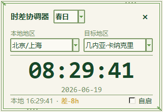
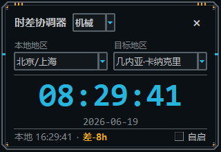
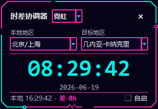

# 时差协调器

一个使用 Python 标准库制作的 Windows 桌面时差小挂件，适合跨地区团队、港口业务和海外协作场景。

## 界面主题

| 春日 | 机械 | 霓虹 |
| --- | --- | --- |
|  |  |  |

主题可在挂件顶部即时切换，并自动记住上次选择。

## 宠物系统

- 点击顶部“宠物”可在猫科中选择英短猫、三花猫，或在犬科中选择萨摩耶，也可以随时关闭。
- 宠物会在挂件边框内侧移动，即使短暂挡住内容也不会跑到窗口外。
- 宠物会随机切换移动、趴着睡觉、打招呼三种动作；每种动作使用至少 4 帧精灵图播放。
- 宠物选择会随其他配置一起保存；点击游荡中的宠物会立刻打招呼，右键宠物可快速打开选择菜单。

## 窗口调整

- 拖动窗口内容空白区域可移动挂件。
- 将鼠标移到外圈边框，指针变为双向箭头后即可调整宽高。
- 放大窗口时字体保持紧凑，地区选择框会变宽，中央时间区域会获得更多留白。
- 调整后的尺寸以 96 DPI 逻辑像素保存；重新启动或移动到不同缩放比例的显示器时会自动换算。

## 功能

- 无边框、始终置顶的小窗口，可拖动并自动记忆位置与尺寸
- 支持从窗口四边和四角拖动缩放，最小尺寸为 320×220
- 支持 Windows 高 DPI 与多显示器，跨屏后保持一致的视觉尺寸
- 实时显示目标地区时间、日期、本地时间和真实 UTC 时差
- 使用 `zoneinfo` 处理夏令时
- 内置 23 个常见城市与港口时区
- 春日、机械、霓虹三套主题
- 猫科与犬科宠物，支持英短猫、三花猫、萨摩耶，以及移动、睡觉、打招呼三组四帧精灵动画
- 当前用户开机自启设置
- 配置保存到 `%APPDATA%\时差协调器\config.json`
- 支持 PyInstaller 打包为单个 exe

## 环境要求

- Python 3.9+
- Windows 10/11
- `tzdata`（Windows 通常不自带 IANA 时区数据库）

安装运行依赖：

```powershell
python -m pip install tzdata
```

## 直接运行

```powershell
python "时差协调器.py"
```

## 打包 exe

先安装 PyInstaller：

```powershell
python -m pip install pyinstaller tzdata
```

然后执行：

```powershell
pyinstaller --onefile --noconsole --collect-all tzdata --add-data "assets;assets" --name 时差协调器 时差协调器.py
```

生成文件位于 `dist\时差协调器.exe`。

## 内置地区

包括北京/上海、卡纳克里、黑角、弗里敦、阿克拉、吉布提市、达喀尔、阿比让、的黎波里、拉各斯、鹿特丹、汉堡、安特卫普、新加坡、迪拜、香港、釜山、东京、伦敦、巴黎、纽约、洛杉矶和悉尼。

## 技术栈

- GUI：`tkinter`
- 时区：`zoneinfo`
- Windows 自启：`winreg`
- 打包：PyInstaller
